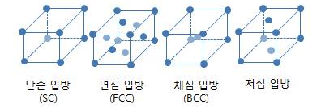
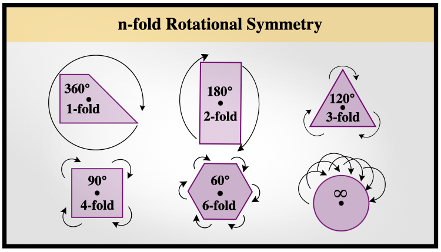
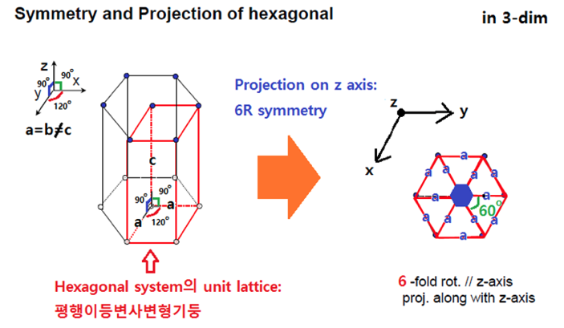
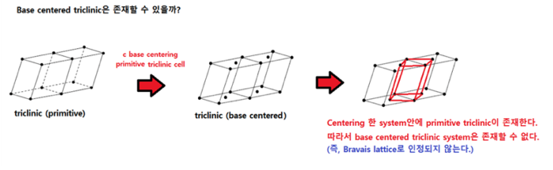
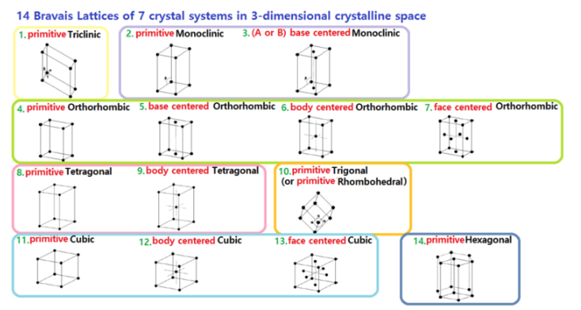
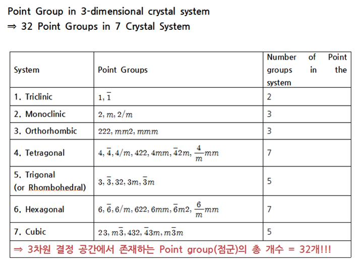
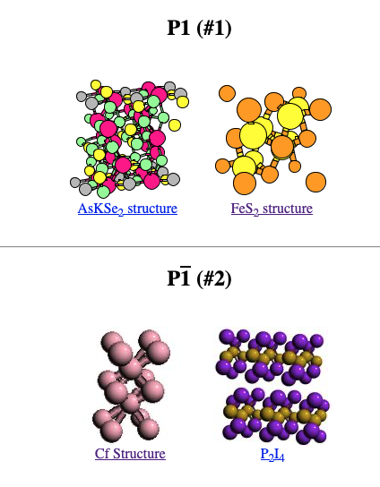


  


### 들어가며

1. 안녕하세요, 오늘 결정계, 점군, 공간군을 설명드리기로 했는데, 이 어려운 논문을 읽다가 Fe가 포함된 Mc(monocarbonate)와 Al이 포함된 Mc의 공간군이 다르다는데 도대체 공간군이 뭔지 모르겠어서 시작되었습니다.
    
    [pp_Iron in carbonate containing AFm phases.pdf](2023-07-12-crystal/pp_Iron_in_carbonate_containing_AFm_phases.pdf)
    
    결정계는 XRD 패턴으로 비교적 쉽게 (?) 알아낼 수 있다고 합니다. 물론 아무 정보도 없는 물질의 패턴을 보고 어떤 결정계에 들어가는지 분석하는 방법은 무진장 복잡합니다. (관심있는 분은 아래 피피티 참조) 
    
    [ppt_Xray-used-to-determine-structure.pdf](2023-07-12-crystal/ppt_Xray-used-to-determine-structure.pdf)
    
    공간군을 결정하는 것은 더 어렵구요. EXAFS나 Raman 등등 추가적인 분석 기법이 활용됩니다(만 저도 여기까지 살펴보지는 못했습니다.)
    
    그런데 설명을 읽을수록, crystal system은 무엇이며 lattice system은 또 무엇이며, 대칭성을 나타내는 point group과 space group은 무엇인지 점점 더 헷갈리더라구요. 그래서 한번 싹 정리하면 좋을 것 같아요! 사실 이게 저희 연구랑 큰 관련이 있을까요...? 사실 없을것 같아요. 근데 논문 읽을때 답답함? 혹은 두려움은 적어질 것 같습니다. ㅎㅎ
    

### 결정계와 격자시스템

1. (제가 이해한 바에 따라) 이들 개념의 위계부터 설명드릴게요. 우선 **결정계**가 가장 큰 개념입니다. 결정은 평행육면체인 단위 격자가 공간에 수없이 반복되는 거라고 생각하시면 되는데, 이 **단위 격자**(unit cell)의 축 변의 길이가 a, b, c, 축간각도가 ⍺, β, γ인 6가지 lattice parameter입니다. 그리고 각 축에 수직한 두 개의 면들은 A, B, C라고 이름붙여줍니다. 각 모서리의 길이가 짧고, 모서리 사이의 각도가 수직에 가깝도록 선택하면 **primitive unit cell**이라고 해요.
2. 결정계는 단위 격자의 격자점 위치에 따라 4가지로 나눌 수 있습니다.
    
    
    
    - 단순 **P**rimitive, 면심 **F**ace-centered, 체심 **I**/Body-centered, 저심 **C**/Base-centered
    - 저심은 다시 A, B, C base-centered로 세가지가 있겠죠!
3. 단위격자 격자점 위치와 무관하게 격자상수(lattice parameter, 축간각도와 축 변의 길이)에 따라 7가지로 나눌 수 있습니다. XRD 분석할때 흔히 접하는 cubic, tetragonal(=rhombohedral), orthorombic, trigonal, monoclinic, hexagonal, triclinic이 바로 그것입니다. 이 7가지 결정계는 고유한 대칭성 특성을 가지고 있고 이걸 바탕으로 이름을 지은 것 같아요.
4. 잠시 대칭성 얘기를 해야할 것 같아요. 대칭성을 파악하는 데에는 반사(reflection), 회전(rotation), 반전(inverse, 점대칭), 병진(translation), 미끄럼(glide, 병진+반사), 나사(screw, 병진+회전), 총 <span 6가지 대칭 조작을 알아야 합니다. 자세한 설명은 이 [블로그](https://blog.naver.com/PostView.naver?blogId=seojongdeuk&logNo=222844673177)를 참조해주세요.
    - 반사는 거울면(mirror plane)에 대해 반사시키는 거에요. 보통 **m**이라는 기호를 씁니다
    - 회전은 한 축을 기준으로 점들을 회전시키는 거고, 이 회전축은 우리가 n-fold 회전축이라고 합니다. 그림을 보면 더 쉽게 이해될거에요. 보통 **n**이라는 기호를 씁니다
        
        
        
    - 반전은 한 점을 기준으로 모든 점을 점대칭 시키는 거고 보통 **i**라는 기호를 씁니다
    - 병진은 그냥 평행이동 이구요
    - 미끄럼은 이동시킨 다음에 거울면 반사~ 나사는 이동시키면서 회전도 시키는거에요..
5. 그럼 다시 일곱개의 결정계의 이름으로 돌아와서 이름과 모양을 매칭해볼게요.
    - cubic은 정육면체니까 쉽죠, 세 축 변의 길이도 같고, 축간각도도 모두 90도라는 걸 쉽게 유추할 수 있습니다.
    - gonal은 angle이라고 생각하면 된대요. 따라서 회전축에 대한 정보를 주는거에요.tetra (=4)gonal은 4-fold 회전축을 가진다는 뜻이고 90도만큼 돌려서 형태를 유지하는건 정사각형이죠. 그러니까 정사각기둥이라고 떠올릴 수 있어요. tri(=3)gonal은 3-fold 회전축을 가진다는 것이고 정삼각형을 떠올릴 수 있는데, 저희가 평행육면체가 되려면 한 면이 사각형이여야겠죠! 그래서 두 정삼각형을 붙인 마름모(rhombohedral) 여섯개가 90도가 아닌 각을 이루고 있다고 떠올리면 됩니다. hexa(=6)gonal은 6-fold 회전축을 가지니까 정육각형을 떠올릴 수 있습니다. 그런데 평행육면체가 되기 위해서 아래처럼 unit lattice를 잡아줍니다.
                
        
    - clinic은 기울어진 경사면을 떠올리면 됩니다. 따라서 직육면체 위아래면을 두손으로 잡고 주욱 밀어서 경사지게 만드는거에요. mono(=1)clinic은 그걸 한번한거고, tri(=3)clinic은 그걸 세번 하는거죠.
    - orthorhombic은 ortho(=90도)로부터 직육면체임을 떠올릴 수 있습니다!
6. 그런데 이 일곱가지 결정계에서 격자점 외에 면이나, 몸통이나, 아니면 윗면과 아랫면에 원자들을 더 집어넣은 단위 격자를 생각해볼 수 있어요. 다시 말해 네가지 분류 방식과 일곱가지 분류방식을 합치는 거죠. 그러면 단순히 계산해서 28가지의 lattice system이 나올것 같지만 그렇지 않다고 합니다. 우리가 어떤 격자점의 면이나 몸통에 원자를 집어넣고 공간에 무한히 복붙을 하다보면, 처음보다 더 작은 격자시스템이 생기기 때문입니다(아래 그림 참조).

    
    
- primitive lattice로 인정받을 수 없는 경우를 제외하다보면 아래와 같은 14가지의 **bravais lattice system**만 남습니다. 자세한 설명은 이 [블로그](https://blog.naver.com/PostView.nhn?blogId=joon9497&logNo=221448621785)에 잘 설명되어 있어요!
    
    

### 점군과 공간군

1. 이제 쪼오금 더 복잡해집니다. 3차원 결정구조가 같은 대칭성의 종류에 따라서 총 32개의 점군을 가져요. 대칭조작을 했을 때 격자시스템 본연의 대칭성을 깨뜨려서는 안됩니다. 따라서 아래와 같이 32개가 나옵니다.
    
    
2. 그리고 이 점군들과 14개의 bravais lattice를 짬뽕하면 230개 공간군이 나옵니다. 왜 14x32 = 448개가 아니냐구요? 아까 bravais lattice를 유도했던 것처럼 단순히 두가지를 짬뽕했을 때 대칭성이 깨지거나 primitive unit cell의 조건을 만족하지 못하는 (혹은 다른 공간군과 동일해진다거나..) 경우를 제외하여 그렇다고 합니다. 
3. 공간군의 이름은 세 부분으로 나뉩니다: 중심, 대칭, 및 격자 계열.
    1. 중심 (Centering)
        - P: Primitive (원시적) - 각 유닛 셀의 모서리에만 아톰 또는 이온이 존재합니다.
        - I: Body-centered (체심적) - 각 유닛 셀의 모서리와 셀의 중심에 아톰 또는 이온이 존재합니다.
        - C: Base-centered (바닥심적) - 각 유닛 셀의 모서리와 셀의 한 개의 면 (일반적으로 바닥 면)의 중심에 아톰 또는 이온이 존재합니다.
        - F: Face-centered (면심적) - 각 유닛 셀의 모서리와 셀의 모든 면의 중심에 아톰 또는 이온이 존재합니다.
        - A: One face-centered (A면심적) - 모서리와 A면의 중심에만 아톰 또는 이온이 존재합니다.
        - B: One face-centered (B면심적) - 모서리와 B면의 중심에만 아톰 또는 이온이 존재합니다.
        - R: Rhombohedral centering - 삼각뿔 체계의 격자입니다.
    2. 대칭 (Symmetry): 1, 2, 3, 4, 6의 로테이션, 미러(대칭), 그리고 스크류(나사형) 대칭을 나타냅니다.
    3. 격자 계열 (Lattice system): 격자의 기하학적 특성을 나타냅니다. 예를 들어, 정사면체 계열, 육각형 계열, 직사각형 계열 등입니다.
4. 아까 말한 대칭조작들 기억나시나요? 3차원 점군에서는 R(회전), m(반사), i(반전) 세가지를 다룹니다.
기호들이 특이해서 처음에는 익숙해지기가 어려운 것 같아요. 자세한 설명은 이 [블로그](https://blog.naver.com/PostView.naver?blogId=joon9497&logNo=221400940880&parentCategoryNo=&categoryNo=&viewDate=&isShowPopularPosts=false&from=postView)에 잘 나와있고, 각 공간군의 대표적인 물질들과 그림들은 [여기](https://www.atomic-scale-physics.de/lattice/spcgrp/index.html)를 참고해 주세요.
    - 숫자 n은 nR을 의미합니다
        - e.g., 1 = 1R = 1-fold 회전축을 가지는거죠 (다시 말해 360도 회전해야 원래 모양)
    - n 위에 바가 있는 경우는 두가지 조작을 합친거에요.
        - e.g., -1 = 1R+i (= 360도 회전 후 점대칭 했을때 원래 모양)
5. 1, -1을 점군으로 가지는 것은 triclinic이 있습니다. 그리고 점군의 표기 앞에 P를 써주면! 짜잔 드디어 공간군의 표현이 되는거에요 (그림 참조).
    - 1보다는 -1이 대칭성이 높습니다. 왜냐면 1은 360도 회전해야 자기자신이라서, translation(평행이동)했을 때 무한한 결정을 만들 수가 없지만 -1은 평행이동으로 무한한 결정이 만들어지기 때문에 그렇습니다.
        
        
6. monoclinic의 점군으로 넘어가볼게요. 2, m, 2/m은 뭘 뜻할까요?
    - 2 = 2R입니다. monoclinic은 y축에 대해 2-fold rotation symmetry를 갖습니다.
        - 대표적인 P2가 바로 SiO2입니다.
        
        
        
        - 이게 좀 더 나을 것 같아요. monoclinic phosphorus structure이 2P/c 그룹이라고 되어있네요
        
        
        
        - 'P'는 단순(Primitive) 격자를 의미합니다. 이는 각 단위 셀의 모서리에만 원자가 위치해 있음을 나타냅니다.
        - '2'는 2차 회전축(180도 회전에 대한 대칭성)을 나타냅니다.
        - '/'는 미러 평면(mirror plane)이 없음을 나타냅니다.
        - 마지막으로 'c'는 c축을 따라 두 배의 선호도(translational symmetry)를 나타냅니다. 즉, 이것은 원자들이 c축을 따라서 반복되는 패턴이 한 단위 셀의 두 배의 거리에 위치하고 있음을 의미합니다.
    - m은 뭘까요? monoclinic은 y축에 대해 수직인 평면에 대해 reflection을 가집니다.
    - 2/m은 하나의 축을 기준으로 2-fold rotation과 이 축에 수직한 면에 대해 reflection symmetry를 가지는 것을 의미합니다. monoclinic중에서 highest symmetry에 해당합니다
        - NiTi를 보시겠습니다.. 느낌 오시나요?
            
            
            

 orthorhombic 이후는 한번 직접 살펴보시는 것도 좋을 것 같아요. 이제 R-3c가 어떤거일지 살짝 느낌 오시겠죠?!!

### 부록

VESTA 사용하기

[Download - VESTA](https://jp-minerals.org/vesta/en/download.html)

괜찮은 입문용 youtube

[VESTA 기본 사용 방법](https://www.youtube.com/watch?v=ndYuFgGda_c)

---

## 요약 (작업 중...)

### 각 개념들의 관계

### Crystal system (결정계) 요약

1. 단위격자(Unit cell)의 격자점 위치에 따라 4가지로 나누거나
    - 원시 단위격자: 꼭지점에만 격자점이 있음
        - 단순 (P)
    - 비-원시 단위격자
        - 면심 (F)
        - 체심 (I)
        - 저심 (C)
    - 단위격자는 결정을 형성하는 공간격자에서 최소의 반복단위가 되는 **평행육면체**를 의미하며, 보통 각 모서리의 길이가 짧고, 모서리 사이의 각도가 수직에 가깝도록 선택함 (normally chosen **primitive unit cell**)
2. 단위격자 격자점 위치와 무관하게 격자상수(축 간 각도, 축 변의 길이)에 따라 7가지로 나눌 수 있음
    - 각 결정 체계는 <u>고유한 대칭성 특성</u>을 가지고 있으며, 이것이 결정 체계를 분류하는 주요 기준이 됨.
    - cubic (입방정계, 정육면체) - 36개의 공간군을 가짐
        - a = b = c, α = β = γ = 90°
        - 가장 높은 대칭성, 4개의 3-fold 회전축을 가짐
    - tetragonal (정방정계, 정사각기둥) - 68개의 공간군을 가짐
        - a = b ≠ c, α = β = γ = 90°
        - 하나의 4-fold 회전축을 가짐
    - orthorhombic (사방정계, 직육면체) - 59개의 공간군을 가짐
        - a ≠ b ≠ c, α = β = γ = 90°
        - 3개의 2-fold 회전축을 가짐
    - trigonal = rhombohedral (삼방) - 7개의 공간군을 가짐
        - a = b = c, α = β = γ ≠ 90°
        - 하나의 3-fold 회전축
    - monoclinic (단사) - 13개의 공간군을 가짐
        - a ≠ b ≠ c, α = γ = 90° ≠ β
        - 하나의 2-fold 회전축
    - hexagonal (육방) - 45개의 공간군을 가짐
        - a = b ≠ c, α = β = 90°, γ = 120°
        - 하나의 6-fold 회전축
    - triclinic (삼사) - 2개의 공간군을 가짐
        - a ≠ b ≠ c, α ≠ β ≠ γ ≠ 90°
        - 대칭축이 없음

### Bravais lattice system

- 위의 7 결정계에 격자점 위치에 따른 4가지 구분 방식을 결합하여 자연계에 존재 가능한 결정구조 형태를 14개로 규격화 함

### 물질의 대칭성 표기법

- 쇤플리스 표기법: 점군을 표기하는 방법의 하나 → 주로 분자에 대해 사용
- 헤르만-모갱 표기법: 점군 또는 공간군을 표기하는 방법

[http://www.ktword.co.kr/test/view/view.php?m_temp1=4546](http://www.ktword.co.kr/test/view/view.php?m_temp1=4546)
